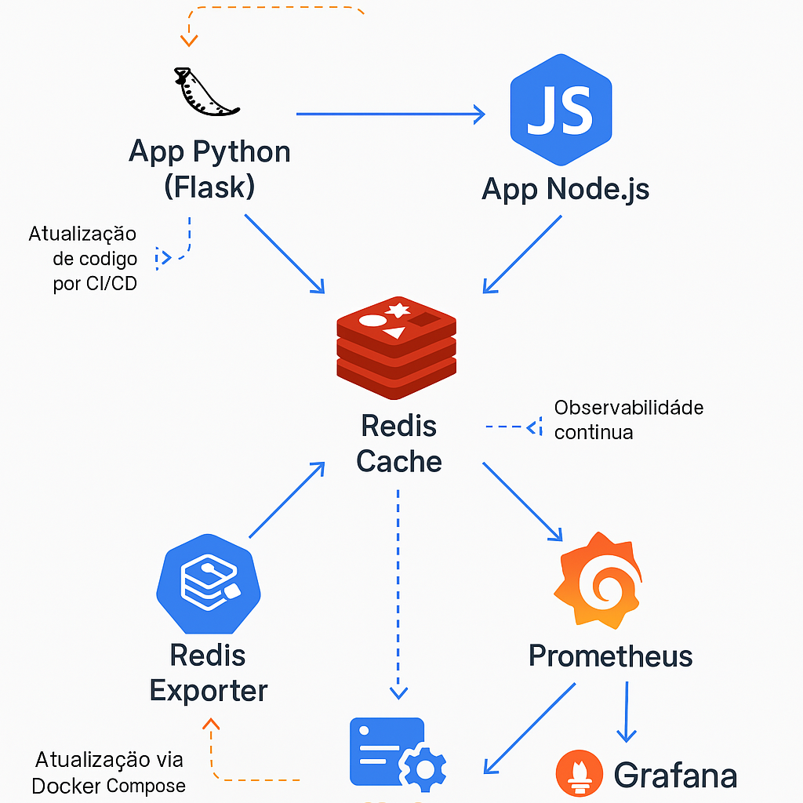

# 🚀 Desafio DevOps 2025

Este repositório contém a solução para o **Desafio DevOps 2025**, com foco em aplicações distribuídas, cache, observabilidade e infraestrutura automatizada com Docker Compose.

---

## 🔧 Tecnologias Utilizadas

- Python (Flask)
- Node.js (Express)
- Redis (cache)
- Docker e Docker Compose
- Prometheus
- Grafana
- Redis Exporter
- Node Exporter

---

## 🧱 Estrutura do Projeto

```
desafio-devops-2025/
├── app-python/           # App em Flask com cache e métricas
├── app-node/             # App em Node.js com cache e métricas
├── prometheus.yml        # Configuração do Prometheus
├── docker-compose.yml    # Orquestração dos serviços
├── grafana/              # Dashboards personalizados
└── README.md
```

---

## ▶️ Como Executar

### Pré-requisitos:
- Docker
- Docker Compose

### Executar com um único comando:

```bash
docker-compose up --build
```

### Aplicações disponíveis:

- Flask: http://localhost:5001
- Node.js: http://localhost:3000
- Prometheus: http://localhost:9090
- Grafana: http://localhost:3001 (login: `admin` / `admin`)

---

## 📈 Monitoramento

O stack de observabilidade inclui:

- **Prometheus**: coleta métricas dos apps, Redis e do sistema
- **Grafana**: dashboards com visualização em tempo real
- **Node Exporter**: métricas do host
- **Redis Exporter**: uso e performance do Redis

### Dashboards:
- Requisições e latência das rotas
- Uso de CPU, memória e disco
- Conexões e uso de memória do Redis
- Erros HTTP (4xx, 5xx)

---

## 🗺️ Diagrama de Arquitetura



---

## 💡 Sugestões de Melhoria

- Implementar CI/CD com GitHub Actions ou GitLab CI
- Testes automatizados para as aplicações
- Health checks nos containers
- Rate limiting e autenticação de rotas
- Cache hit/miss ratio detalhado por rota

---

## 🤝 Contribuições

Pull Requests são bem-vindos. Para sugestões, abra uma issue ou entre em contato comigo!
